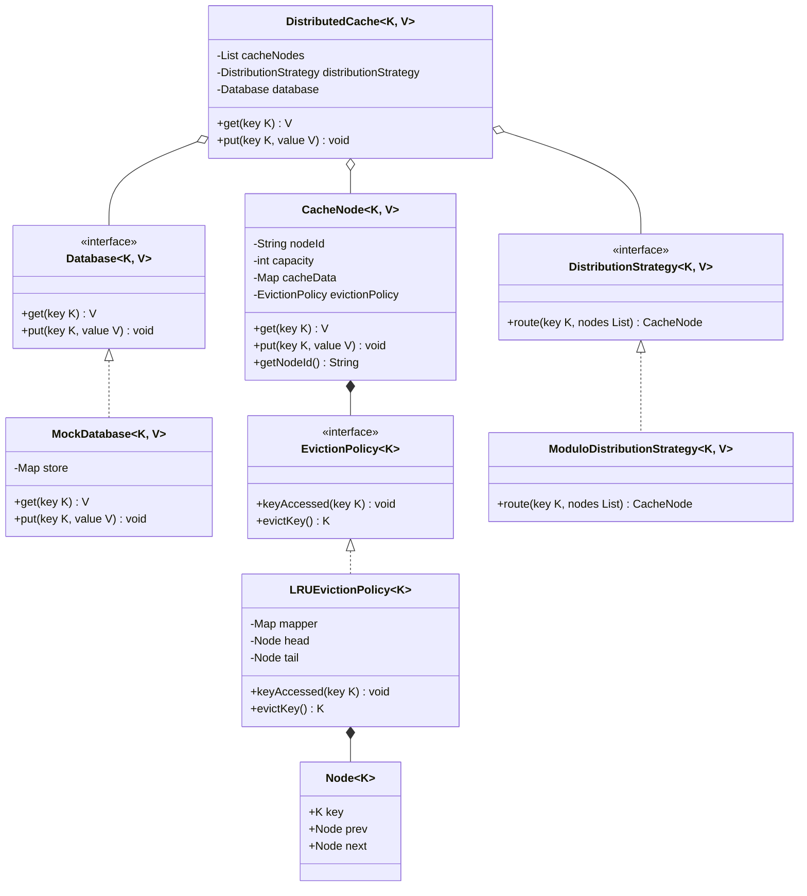

# Distributed Cache System LLD

## UML Diagram

```mermaid
classDiagram
    class Database~K, V~ {
        <<interface>>
        +get(key K) V
        +put(key K, value V) void
    }
    class MockDatabase~K, V~ {
        -Map store
        +get(key K) V
        +put(key K, value V) void
    }

    class EvictionPolicy~K~ {
        <<interface>>
        +keyAccessed(key K) void
        +evictKey() K
    }
    class Node~K~ {
        +K key
        +Node prev
        +Node next
    }
    class LRUEvictionPolicy~K~ {
        -Map mapper
        -Node head
        -Node tail
        +keyAccessed(key K) void
        +evictKey() K
    }

    class DistributionStrategy~K, V~ {
        <<interface>>
        +route(key K, nodes List) CacheNode
    }
    class ModuloDistributionStrategy~K, V~ {
        +route(key K, nodes List) CacheNode
    }

    class CacheNode~K, V~ {
        -String nodeId
        -int capacity
        -Map cacheData
        -EvictionPolicy evictionPolicy
        +get(key K) V
        +put(key K, value V) void
        +getNodeId() String
    }

    class DistributedCache~K, V~ {
        -List cacheNodes
        -DistributionStrategy distributionStrategy
        -Database database
        +get(key K) V
        +put(key K, value V) void
    }

    Database <|.. MockDatabase
    EvictionPolicy <|.. LRUEvictionPolicy
    DistributionStrategy <|.. ModuloDistributionStrategy
    LRUEvictionPolicy *-- Node
    DistributedCache o-- CacheNode
    DistributedCache o-- DistributionStrategy
    DistributedCache o-- Database
    CacheNode *-- EvictionPolicy
```