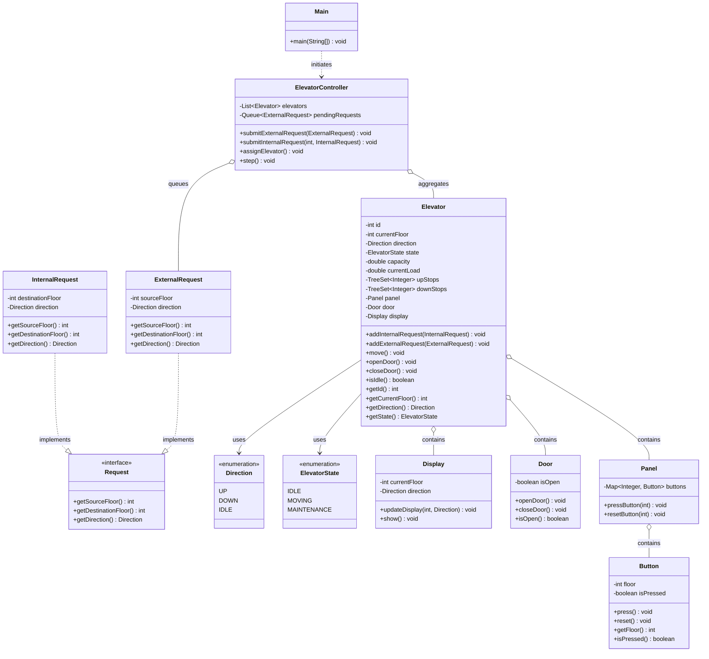

# Elevator LLD

This is a step-based Multi-Car Elevator simulation

## UML Diagram

```mermaid
classDiagram
    class Direction {
        <<enumeration>>
        UP
        DOWN
        IDLE
    }

    class ElevatorState {
        <<enumeration>>
        IDLE
        MOVING
        MAINTENANCE
    }

    class Request {
        <<interface>>
        +getSourceFloor() int
        +getDestinationFloor() int
        +getDirection() Direction
    }

    class InternalRequest {
        -int destinationFloor
        -Direction direction
        +getSourceFloor() int
        +getDestinationFloor() int
        +getDirection() Direction
    }

    class ExternalRequest {
        -int sourceFloor
        -Direction direction
        +getSourceFloor() int
        +getDestinationFloor() int
        +getDirection() Direction
    }

    class Button {
        -int floor
        -boolean isPressed
        +press() void
        +reset() void
        +getFloor() int
        +isPressed() boolean
    }

    class Panel {
        -Map~Integer, Button~ buttons
        +pressButton(int) void
        +resetButton(int) void
    }

    class Door {
        -boolean isOpen
        +openDoor() void
        +closeDoor() void
        +isOpen() boolean
    }

    class Display {
        -int currentFloor
        -Direction direction
        +updateDisplay(int, Direction) void
        +show() void
    }

    class Elevator {
        -int id
        -int currentFloor
        -Direction direction
        -ElevatorState state
        -double capacity
        -double currentLoad
        -TreeSet~Integer~ upStops
        -TreeSet~Integer~ downStops
        -Panel panel
        -Door door
        -Display display
        +addInternalRequest(InternalRequest) void
        +addExternalRequest(ExternalRequest) void
        +move() void
        +openDoor() void
        +closeDoor() void
        +isIdle() boolean
        +getId() int
        +getCurrentFloor() int
        +getDirection() Direction
        +getState() ElevatorState
    }

    class ElevatorController {
        -List~Elevator~ elevators
        -Queue~ExternalRequest~ pendingRequests
        +submitExternalRequest(ExternalRequest) void
        +submitInternalRequest(int, InternalRequest) void
        +assignElevator() void
        +step() void
    }

    class Main {
        +main(String[]) void
    }

    InternalRequest ..|> Request : implements
    ExternalRequest ..|> Request : implements
    ElevatorController o-- Elevator : aggregates
    ElevatorController o-- ExternalRequest : queues
    Elevator o-- Panel : contains
    Elevator o-- Door : contains
    Elevator o-- Display : contains
    Panel o-- Button : contains
    Elevator --> ElevatorState : uses
    Elevator --> Direction : uses
    Main ..> ElevatorController : initiates
```