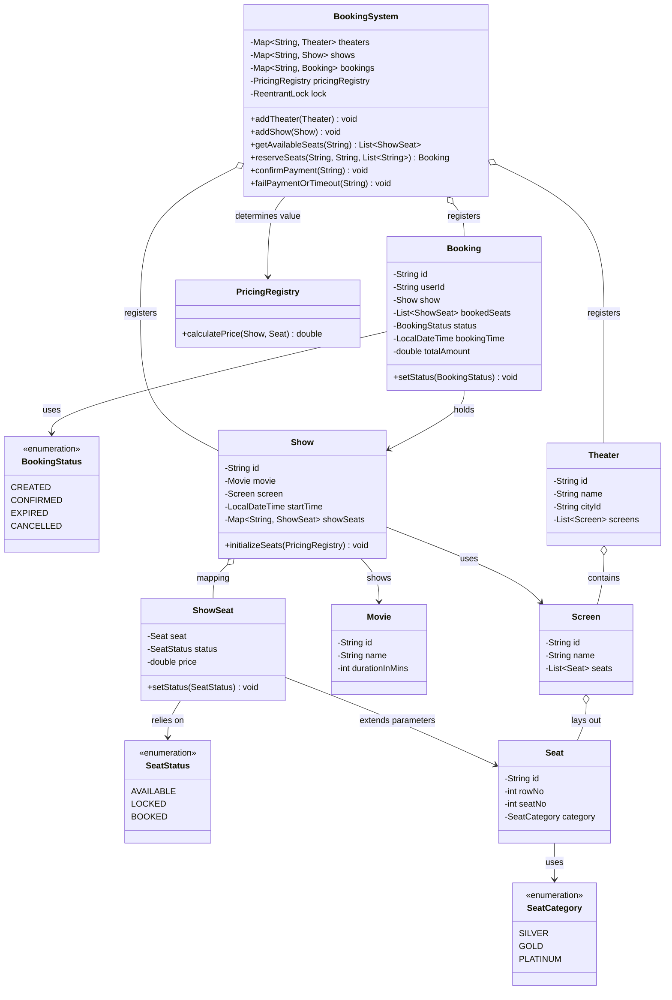

# Movie Ticket Booking System LLD

This is a Movie Ticket Booking System LLD

## UML Diagram

```mermaid
classDiagram
    class SeatCategory {
        <<enumeration>>
        SILVER
        GOLD
        PLATINUM
    }

    class BookingStatus {
        <<enumeration>>
        CREATED
        CONFIRMED
        EXPIRED
        CANCELLED
    }

    class SeatStatus {
        <<enumeration>>
        AVAILABLE
        LOCKED
        BOOKED
    }

    class Seat {
        -String id
        -int rowNo
        -int seatNo
        -SeatCategory category
    }

    class Screen {
        -String id
        -String name
        -List~Seat~ seats
    }

    class Theater {
        -String id
        -String name
        -String cityId
        -List~Screen~ screens
    }

    class Movie {
        -String id
        -String name
        -int durationInMins
    }

    class ShowSeat {
        -Seat seat
        -SeatStatus status
        -double price
        +setStatus(SeatStatus) void
    }

    class Show {
        -String id
        -Movie movie
        -Screen screen
        -LocalDateTime startTime
        -Map~String, ShowSeat~ showSeats
        +initializeSeats(PricingRegistry) void
    }

    class Booking {
        -String id
        -String userId
        -Show show
        -List~ShowSeat~ bookedSeats
        -BookingStatus status
        -LocalDateTime bookingTime
        -double totalAmount
        +setStatus(BookingStatus) void
    }

    class PricingRegistry {
        +calculatePrice(Show, Seat) double
    }

    class BookingSystem {
        -Map~String, Theater~ theaters
        -Map~String, Show~ shows
        -Map~String, Booking~ bookings
        -PricingRegistry pricingRegistry
        -ReentrantLock lock
        +addTheater(Theater) void
        +addShow(Show) void
        +getAvailableSeats(String) List~ShowSeat~
        +reserveSeats(String, String, List~String~) Booking
        +confirmPayment(String) void
        +failPaymentOrTimeout(String) void
    }

    Theater o-- Screen : contains
    Screen o-- Seat : lays out
    Show --> Movie : shows
    Show --> Screen : uses
    Show o-- ShowSeat : mapping
    ShowSeat --> SeatStatus : relies on
    ShowSeat --> Seat : extends parameters
    Seat --> SeatCategory : uses
    Booking --> BookingStatus : uses
    Booking --> Show : holds
    BookingSystem --> PricingRegistry : determines value
    BookingSystem o-- Booking : registers
    BookingSystem o-- Theater : registers
    BookingSystem o-- Show : registers
```