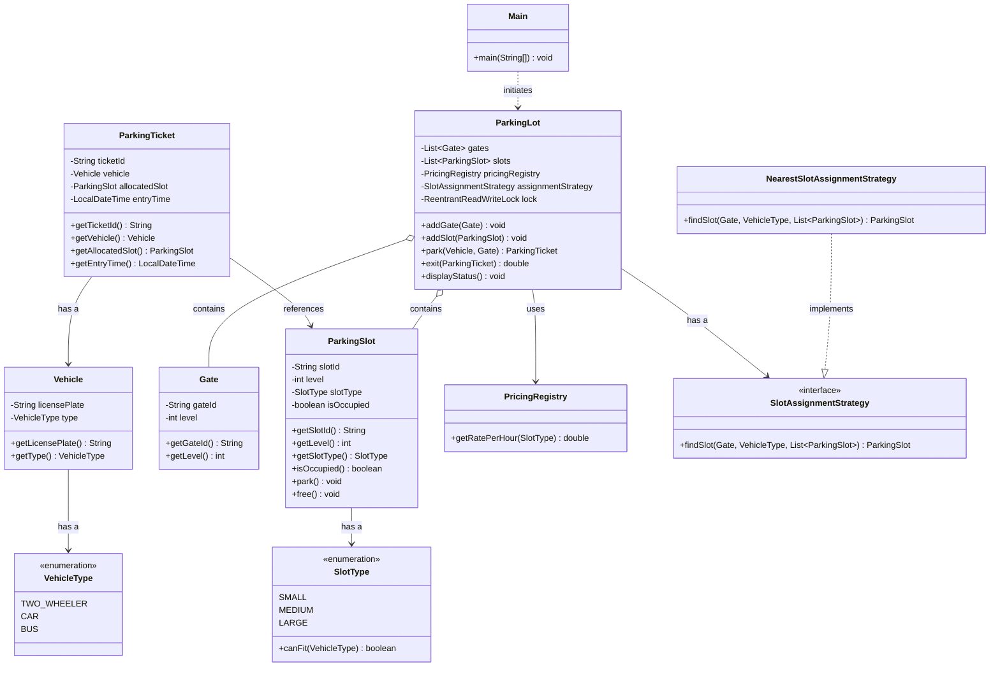

# Multilevel Parking Lot LLD

This is a thread-safe implementation of a Multi-Level Parking Lot low-level design. 

## UML Diagram

```mermaid
classDiagram
    class VehicleType {
        <<enumeration>>
        TWO_WHEELER
        CAR
        BUS
    }

    class SlotType {
        <<enumeration>>
        SMALL
        MEDIUM
        LARGE
        +canFit(VehicleType) boolean
    }

    class Vehicle {
        -String licensePlate
        -VehicleType type
        +getLicensePlate() String
        +getType() VehicleType
    }

    class Gate {
        -String gateId
        -int level
        +getGateId() String
        +getLevel() int
    }

    class ParkingSlot {
        -String slotId
        -int level
        -SlotType slotType
        -boolean isOccupied
        +getSlotId() String
        +getLevel() int
        +getSlotType() SlotType
        +isOccupied() boolean
        +park() void
        +free() void
    }

    class ParkingTicket {
        -String ticketId
        -Vehicle vehicle
        -ParkingSlot allocatedSlot
        -LocalDateTime entryTime
        +getTicketId() String
        +getVehicle() Vehicle
        +getAllocatedSlot() ParkingSlot
        +getEntryTime() LocalDateTime
    }

    class PricingRegistry {
        +getRatePerHour(SlotType) double
    }

    class SlotAssignmentStrategy {
        <<interface>>
        +findSlot(Gate, VehicleType, List~ParkingSlot~) ParkingSlot
    }

    class NearestSlotAssignmentStrategy {
        +findSlot(Gate, VehicleType, List~ParkingSlot~) ParkingSlot
    }

    class ParkingLot {
        -List~Gate~ gates
        -List~ParkingSlot~ slots
        -PricingRegistry pricingRegistry
        -SlotAssignmentStrategy assignmentStrategy
        -ReentrantReadWriteLock lock
        +addGate(Gate) void
        +addSlot(ParkingSlot) void
        +park(Vehicle, Gate) ParkingTicket
        +exit(ParkingTicket) double
        +displayStatus() void
    }

    class Main {
        +main(String[]) void
    }

    NearestSlotAssignmentStrategy ..|> SlotAssignmentStrategy : implements
    ParkingLot --> SlotAssignmentStrategy : has a
    ParkingLot --> PricingRegistry : uses
    ParkingLot o-- ParkingSlot : contains
    ParkingLot o-- Gate : contains
    Vehicle --> VehicleType : has a
    ParkingSlot --> SlotType : has a
    ParkingTicket --> Vehicle : has a
    ParkingTicket --> ParkingSlot : references
    Main ..> ParkingLot : initiates
```