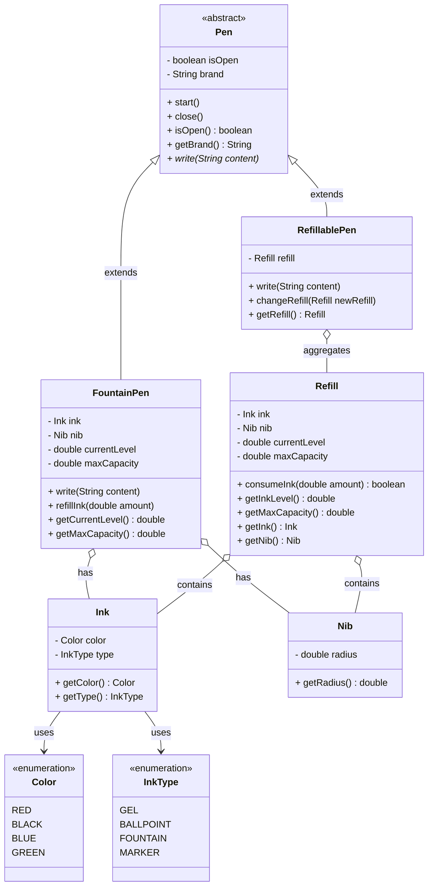

# Pen LLD

A low-level design implementation modeling generic Pen mechanics in Java. This project strongly adheres to Object-Oriented Programming (OOP) concepts and SOLID principles, establishing a clean schema for various ink-handling strategies and physical pen state manipulation.

## Features
- Independent `Ink` metadata components (Enums: `Color` / `InkType`).
- Core physical component integration via composition (`Nib`, `Refill`).
- Abstract framework forcing implementations to validate `start()` (cap open) and `close()` (cap locked) states before writing.
- Dynamic polymorphic refill behaviors between:
  - `FountainPen`: Additive fluid behavior (`refillInk`).
  - `RefillablePen`: Substitutive cartridge behavior (`changeRefill`).

## UML Class Diagram

## Core Design Principles
- **Template Method Pattern**: The abstract `Pen` class implements concrete pre-operation checks for `start()` and `close()`, but handles `#write` abstractly, allowing child implementations to dictate ink behaviors safely.
- **Composition over Inheritance**: Features like `Refill`, `Ink`, and `Nib` act as standalone reusable models allowing `RefillablePen` and `FountainPen` to freely compose them instead of building massive inheritance trees.