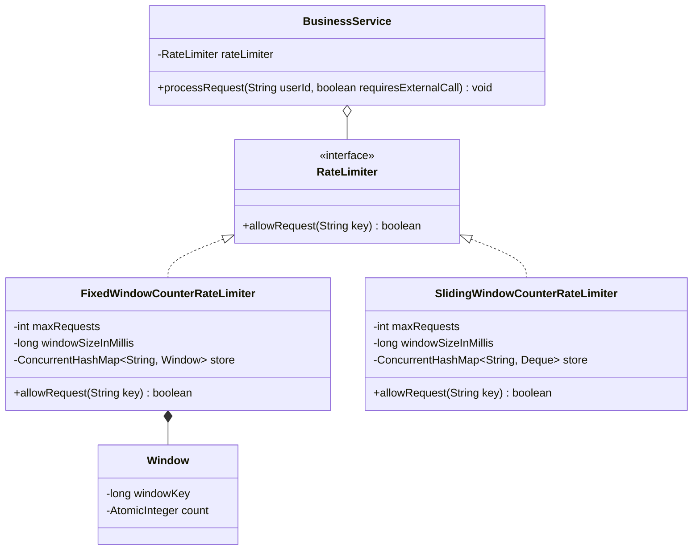

# Rate Limiting System LLD

## UML Diagram

```mermaid
classDiagram
    class RateLimiter {
        <<interface>>
        +allowRequest(String key) boolean
    }
    class FixedWindowCounterRateLimiter {
        -int maxRequests
        -long windowSizeInMillis
        -ConcurrentHashMap~String, Window~ store
        +allowRequest(String key) boolean
    }
    class Window {
        -long windowKey
        -AtomicInteger count
    }
    class SlidingWindowCounterRateLimiter {
        -int maxRequests
        -long windowSizeInMillis
        -ConcurrentHashMap~String, Deque~ store
        +allowRequest(String key) boolean
    }
    class BusinessService {
        -RateLimiter rateLimiter
        +processRequest(String userId, boolean requiresExternalCall) void
    }

    RateLimiter <|.. FixedWindowCounterRateLimiter
    RateLimiter <|.. SlidingWindowCounterRateLimiter
    FixedWindowCounterRateLimiter *-- Window
    BusinessService o-- RateLimiter
```